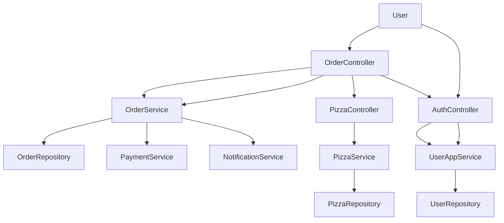

```mermaid
graph TD;
    %% Пользователь
    User[User] --> OrderController[OrderController];

    %% Auth
    User --> AuthController[AuthController];
    AuthController --> UserAppService[UserAppService];
    UserAppService --> UserRepository[UserRepository];

    %% Заказы
    OrderController --> OrderService[OrderService];
    OrderService --> OrderRepository[OrderRepository];

    %% Оплата
    OrderController --> OrderService;
    OrderService --> PaymentService[PaymentService];

    %% Уведомления
    OrderService --> NotificationService[NotificationService];

    %% Пиццы
    OrderController --> PizzaController[PizzaController];
    PizzaController --> PizzaService[PizzaService];
    PizzaService --> PizzaRepository[PizzaRepository];

    %% Временные пользователи
    OrderController --> AuthController;
    AuthController --> UserAppService;

```